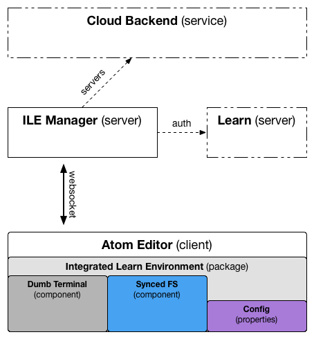

# Integrated Learn Environment Package

The goal of this package is to provide Atom with an integration to Learn that is as OS-independent as possible. To meet this goal, the Atom API should be relied upon wherever possible. The point of this is to provide a reasonable level of confidence that wherever Atom can run, the Learn Integrated Environment can also run.

To accomplish this, some design principles are presented:

* Terminal interaction should be "dumb".
  * Assume the host doesn't have a native SSH client, as is the case with Windows.
  * Assume the host doesn't have support for a scripting language, as is the case with Windows (PowerShell may or may not exist, depending on the version of Windows).
  * Forward input to the student's server.
* Reliance on a filesystem structure should be minimal. Don't assume certain paths exist.
